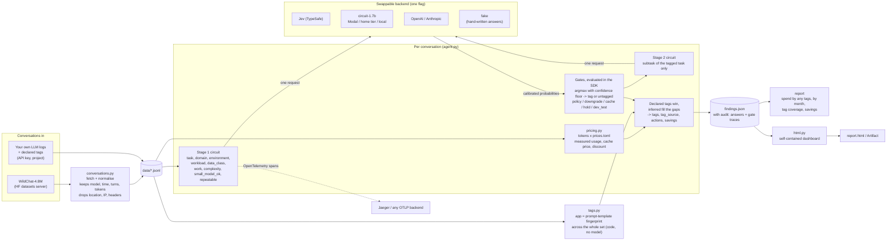

# finops-circuit

Tag LLM spend the way cloud spend is tagged, then say what to change. Built on
[decision circuits](https://github.com/Barneyjm/decision-circuits).

Each conversation gets allocation tags, `app`, `workload`, `environment`, `task` and `subtask`,
`domain`, `data_class`, and a cost line from its tokens. A decision model answers the tag
questions with probabilities; plain code turns them into tags, a tag it is not sure of comes
out `untagged`, and the report groups spend by any tags the way a cloud bill is grouped.

```
$ finops analyze samples --backend fake

== 11_keyword_app.json  gpt-4o-2024-08-06, 1 replies, $0.0003  (44 in / 20 out)
   Provide only relevant keywords to facilitate an online search for the product below. Return a comma-separated
-> app=app-fb9384 workload=automated environment=production task=extraction subtask=keywords domain=marketing_sales data_class=public
   business=True saves $0.0003 | small model ok 0.95 | repeatable 0.90
   * downgrade to gpt-4o-mini
   * cache or template: a common request
   task         decided   task -> extraction p=0.85 conf=0.69 (min 0.2)
   subtask      decided   subtask -> keywords p=0.85 conf=0.58 (min 0.2)
```

## How it fits together



The model answers questions; everything it feeds is code. Pricing never sees the model's
answers, the `app` tag never sees the model, and the gates run in the decision-circuits SDK
on the client, the same arithmetic whichever backend answered (and proved in Lean in that
repo).

## Run it

```bash
git clone https://github.com/Barneyjm/finops-circuit && cd finops-circuit
uv sync
cp .env.example .env                                   # one key for the backend you pick
uv run finops fetch --n 200                            # a WildChat-4.8M sample into data/
uv run finops report data/wildchat.jsonl --backend jev --by task,subtask
```

| | |
|---|---|
| `finops fetch --n N` | N real conversations from WildChat-4.8M into `data/wildchat.jsonl` |
| `finops analyze <file or dir>` | per conversation: tags, cost, actions, the gate traces |
| `finops report <file or dir> --by k1,k2` | spend grouped by tag keys, tag coverage, actions, savings |
| `finops report ... --save findings.json` then `finops html findings.json` | the dashboard: one self-contained HTML file (conversation text left out unless `--with-text`) |
| `finops focus findings.json --out focus.csv` | the same spend as a FOCUS 1.4 Cost and Usage dataset |
| `finops reprice findings.json --prices mine.toml` | the saved findings under a new price table: costs and actions again, no model calls |
| `finops diagram` | the circuit as Mermaid |

`--backend` picks the model, as in [call-center-circuit](https://github.com/Barneyjm/call-center-circuit):
`jev`, `circuits`, `local`, `semif`, `openai`, `anthropic`, or `fake` (hand-written answers in
`samples/`, no network).

## The tags

| tag | set by | values |
|---|---|---|
| `app` | code: the prompt template (below) | `app-<hex>`, or `adhoc` for people typing |
| `workload` | the circuit | `interactive`, `automated` |
| `environment` | the circuit | `production`, `dev_test` |
| `task` | the circuit, stage one | code, writing, summarization, translation, extraction, classification, data_analysis, research, advice, creative, chit_chat, other |
| `subtask` | the circuit, stage two | that task's kinds only: code → generate, debug, explain, review, convert, sql; writing → email_message, marketing_copy, social_post, document, rewrite, job_application; ... |
| `domain` | the circuit | software, marketing_sales, customer_support, finance, legal, hr_people, education, health, operations, science_engineering, media_entertainment, personal_life, other |
| `data_class` | the circuit | public, internal, confidential, regulated |

**Two stages.** The first request asks every tag question at once; a second asks only the
subtasks of the task the first one tagged, so "which kind of code work" is never asked of a
poem. A tag below the confidence floor is `untagged`, never guessed, and the report gives tag
coverage as the share of spend each tag covers.

**Apps come from code.** A program wraps each input in the same fixed instructions, so its
conversations open with the same words. The opening of the first message with numbers,
quotes, links and addresses blanked is the template key; a key three or more conversations
open with, going on to say different things, is one app. The same message sent many times
("hello! how are you today?") is a repeated request, not a program.

**Declared tags win.** A conversation that carries tags from its own metadata (`"tags":
{"environment": "dev_test", "app": "billing-service"}`, from an API key, a project, a header)
keeps them; the circuit fills the gaps, and `tag_source` says which is which. Environment
especially belongs in metadata: whether traffic is a test is rarely in its text.

## Your own tags

The tags are a TOML file, `finops/taxonomy.toml` by default; copy it and pass `--taxonomy`.

```toml
[tags.team]
question = "Which team would own this work?"
[tags.team.options]
growth = "Marketing and sales"
platform = "Engineering"

[tags.stage]                       # a child: asked in a second request, only for the value team got
parent = "team"
question = "Which {parent} activity?"
[tags.stage.options.platform]
build = "Building"
run = "Running"

[actions]                          # point the built-in actions at any tag values
hold = { risk = ["high"] }
dev_test = { environment = ["dev_test"] }
```

Every tag is a question and a gate; the first tag is the primary one (a conversation it cannot
tag goes to review, and reports group by it unless told otherwise). A child tag whose parent
has no options for it is `n/a`, not `untagged`. Tags a conversation declares need not be in the
taxonomy at all: `"tags": {"cost_center": "cc-4411", "team": "growth"}` passes `cost_center`
through to the report, the dashboard and FOCUS, and a declared `team` wins over the inferred
one. The file is checked on load: a parent that is not a tag, an action value that is not an
option, or a tag named `app` (set in code) is refused.

## FOCUS

`finops focus` writes the findings as a [FOCUS 1.4](https://focus.finops.org) Cost and Usage
dataset, so LLM spend loads into the same FinOps tools as cloud bills. Each conversation is a
usage row per kind of token, since each is priced separately: input, cached input (when the log
recorded any) and output.

| column | value |
|---|---|
| ServiceCategory / ServiceSubcategory | AI and Machine Learning / Generative AI |
| ServiceProviderName, HostProviderName, InvoiceIssuerName | the model's vendor |
| ChargeCategory, ChargeFrequency, PricingCategory | Usage, Usage-Based, Standard |
| ConsumedQuantity / ConsumedUnit | tokens / `Tokens` |
| PricingQuantity / PricingUnit | tokens / 1e6 / `1000000 Tokens` |
| ListUnitPrice, ContractedUnitPrice | the price table's list price, and after its `discount` |
| ListCost; ContractedCost = EffectiveCost = BilledCost | tokens x list price; the same after the discount |
| BillingCurrency, PricingCurrency | the price table's `currency` |
| ChargePeriodStart/End, BillingPeriodStart/End | the conversation's hour, its month |
| ResourceId / ResourceName / ResourceType | the conversation / its app / `Conversation` |
| SkuId, SkuPriceId, SkuMeter | `<model>/input-tokens` (or `cached-input-tokens`, `output-tokens`), its price, `Input Tokens` |
| Tags | declared tags as given; inferred and code tags under the `finops-circuit/` prefix |
| x_ columns | tag sources, whether a quantity is estimated, actions, potential savings |

FOCUS wants one prefix-free user tag scheme and a prefix on every other, so what a conversation
declares keeps its keys and what this tool infers carries `finops-circuit/`. Untagged and n/a
values are left out of Tags. Quantities the log did not record are marked `x_QuantityEstimated`.

## What the report recommends

Gates over the same answers (`finops/circuit.py`), actions in code (`finops/agent.py`):

| action | when | saves |
|---|---|---|
| policy | not business use | all of it |
| dev/test on a premium model | environment is dev_test and the model is not small | the difference to the table's `small_model` (gpt-4o-mini) |
| downgrade | a small model would do and the work is not hard | the difference to `small_model` |
| prompt caching | the model (or the one it moves to) has a cache price, and resent history that the cache did not serve is 10% of the cost or more | that history at the cache price instead of full price |
| cache or template | many people make the same request | no dollar figure: depends on repeats |
| hold | confidential or regulated data | nothing moves models or gets cached without a person |
| trim context | six or more replies, resent history a third of the bill or more, and the model has no prompt cache | |
| review | the task could not be tagged, or business use is unsure | |

Cost: a chat API is sent the whole conversation every turn, so a reply's input is everything
before it and a long conversation costs roughly the square of its length. Savings per action
add up: a downgrade's caching figure is priced on the small model, not twice.

## Prices and token usage

Prices live in [`finops/prices.toml`](finops/prices.toml): per model, `input`, `output`,
`cached_input` (leave it out where there is no prompt cache) and `discount` (your contracted
discount off list, 0 to 1), plus the table's `currency` and the `small_model` downgrades are
priced on. A model matches the longest key its name starts with. Copy the file and pass it:

```toml
[settings]
currency = "USD"
small_model = "gpt-4.1-mini"

[models."gpt-4.1"]
input = 2.00
output = 8.00
cached_input = 0.50
discount = 0.15
```

```bash
uv run finops report data/wildchat.jsonl --prices mine.toml --save data/findings.json
uv run finops reprice data/findings.json --prices other.toml    # what-if, no model calls
uv run finops focus data/findings.json --prices other.toml      # --prices on focus or html reprices on the fly
```

Repricing bills the saved token counts again and decides the actions again from the saved
gates: it needs neither the conversations nor the backend.

Token counts come from the log where it has them. An assistant turn may carry the provider's
own `usage`, as the OpenAI and Anthropic APIs return it:

```json
{"role": "assistant", "content": "...", "usage": {"input_tokens": 1300, "output_tokens": 90, "cached_tokens": 1024}}
```

Then input, cached and output tokens are used as billed, cached tokens are priced at
`cached_input`, and FOCUS gets a cached-input row. Without `usage`, output tokens come from the
turn's `tokens` (WildChat records them) or its length, input is the history before the reply at
four characters a token, and nothing is cached. **WildChat records no input or cache counts**,
so on it every input figure is an estimate and caching shows up only as a recommendation. Logs
from your own gateway (LiteLLM, Helicone, an OpenAI proxy) carry `usage` per call; the
[Chutes trace](https://github.com/HarvardMadSys/chutes_workload) has real cached-token counts
but no text to tag.

## A thousand real conversations

`finops report` on 1,000 WildChat conversations (14 models, June 2023 to July 2025), tagged by
Jev, then `finops html`:

| | |
|---|---|
| spend | $7.84 at list prices, 4.05M input tokens (estimated) and 0.53M output |
| tag coverage (share of spend) | task, domain, data_class 100%; subtask 99.8%; workload 80%; environment 77%; fully tagged 64% |
| largest tasks by spend | writing 24%, code 19%, creative 18%, research 17% |
| apps found | 44 templated programs |
| business share of spend | 15% |
| costliest month | November 2024 |

WildChat is the log of a free public chatbot run for research, so personal use, role-play and
homework dominate it and business use is low; it is a stress test for the tags, not a picture
of a company's bill. Environment is the weakest tag because whether traffic is a test is rarely
in what it says: declare it where the traffic comes from. circuit-1.7b v2.0 was never trained
on this taxonomy and leaves most of it untagged; Jev tags it confidently. The backend is one
flag.

## Data

[WildChat-4.8M](https://huggingface.co/datasets/allenai/WildChat-4.8M) (AI2, ODC-BY): real
conversations with ChatGPT models. `finops fetch` samples it through Hugging Face's datasets
server and keeps only the model, the language and the turns with their token counts; the
country, state, hashed IP and browser headers WildChat records are dropped before anything is
written. `data/` is not committed. The conversations in `samples/` are written for the tests
and carry hand-written answers; none come from WildChat.

## License

MIT. WildChat data is ODC-BY: attribute AI2 when you publish from it.
